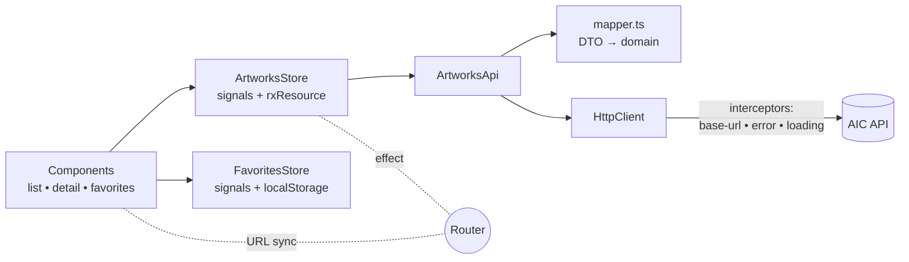

# Art Collection

A modern Angular 21 SPA over the [Art Institute of Chicago](https://api.artic.edu) public API — browse, search, filter, and favorite artworks. Rebuilt from an Angular 13 portfolio project as a 5-day staff-level modernization.

## Features

- Server-rendered first paint with HTTP transfer cache (no refetch on hydration)
- URL-driven view state — `q`, `sort`, `style`, `page` are shareable and refresh-safe
- Debounced search, favorites persisted to localStorage, view-transition image cross-fade between list and detail
- Skeleton / empty / error states wired to the store's `isLoading` / `error` signals
- Optimized images via `NgOptimizedImage`, virtual scroll dense mode (`?dense=1`), hover/focus route preloading
- PWA: offline app shell, IIIF image cache (50 entries / 7 days), API freshness cache (10s timeout)

## Architecture



Layered folders:

```
src/app/
├── core/         HTTP interceptors, URL sync helper, preload strategy, loading signal
├── data/         DTO types, domain types, mapper, ArtworksApi
├── features/    artworks/{list,detail,favorites,state}
├── shared/      reusable presentational components
└── app.config.ts, app.routes.ts
```

## Stack

| Layer           | Tech                                                                                |
| --------------- | ----------------------------------------------------------------------------------- |
| Framework       | Angular 21 (standalone, signals, new control flow)                                  |
| Rendering       | SSR + hydration + HTTP transfer cache (`@angular/ssr`)                              |
| PWA             | `@angular/service-worker` with custom `ngsw-config`                                 |
| UI              | Angular Material 21 (M3 theme)                                                      |
| State           | Signal store (`rxResource`, `computed`, `effect`)                                   |
| HTTP            | `HttpClient` (fetch backend) + functional interceptors                              |
| Tests           | Vitest + `@analogjs/vitest-angular` + Testing Library                               |
| Quality         | ESLint (angular-eslint v21 flat config) + Prettier + Husky                          |
| CI              | GitHub Actions: lint / typecheck / test / build + Lighthouse CI                     |
| Language        | TypeScript 5.9 (strict + `noUncheckedIndexedAccess` + `exactOptionalPropertyTypes`) |
| Runtime         | Node 22 LTS                                                                         |
| Package manager | pnpm 9                                                                              |

## Run it

```bash
# Requires Node 22 (use nvm)
nvm use

pnpm install
pnpm start           # CSR dev server  → http://localhost:4200
pnpm dev:ssr         # SSR dev server  → http://localhost:4200
pnpm build           # production CSR bundle
pnpm build:ssr       # production CSR + SSR bundle
pnpm serve:ssr       # serve the prebuilt SSR bundle  → http://localhost:4000
pnpm test            # Vitest
pnpm test:coverage   # Vitest with coverage
pnpm lint            # ESLint
pnpm typecheck       # tsc --noEmit
```

## Design decisions

Each ADR is ≤ 200 words and lists the tradeoff that lost the decision.

- [0001 — Signal store over NgRx](docs/adr/0001-signal-store-over-ngrx.md)
- [0002 — Standalone components everywhere](docs/adr/0002-standalone-everywhere.md)
- [0003 — DTO/domain split with an explicit mapper](docs/adr/0003-dto-domain-split.md)
- [0004 — URL as the source of truth for view state](docs/adr/0004-url-as-state.md)
- [0005 — SSR + hydration with HTTP transfer cache](docs/adr/0005-ssr-with-transferstate.md)

## Upgrade journey

Modernized from Angular 13.2 to Angular 21 in 8 sequential major-version commits:

| Commit                                | From | To   |
| ------------------------------------- | ---- | ---- |
| `chore(deps): upgrade angular to v14` | 13.2 | 14.3 |
| `chore(deps): upgrade angular to v15` | 14.3 | 15.2 |
| `chore(deps): upgrade angular to v16` | 15.2 | 16.2 |
| `chore(deps): upgrade angular to v17` | 16.2 | 17.3 |
| `chore(deps): upgrade angular to v18` | 17.3 | 18.2 |
| `chore(deps): upgrade angular to v19` | 18.2 | 19.2 |
| `chore(deps): upgrade angular to v20` | 19.2 | 20.3 |
| `chore(deps): upgrade angular to v21` | 20.3 | 21.2 |

See `plan.md` for the full 5-day rebuild plan and what shipped each day.

## What I'd do next

- **Deploy & visual regression.** Wire Vercel (or Cloudflare Pages) with the Angular SSR adapter, then add Storybook + Chromatic so visual diffs land on every PR.
- **Real auth + collections.** Sign in, build personal collections beyond a `Set<string>` in localStorage. Move favorites server-side once auth is real.
- **Better search.** AIC's `/artworks/search` is keyword-only; layered facet filters (artist, medium, century) would benefit from an Elastic-shaped backend or local FlexSearch index.
